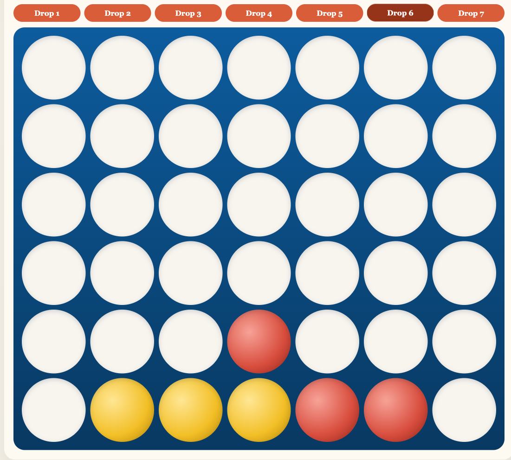
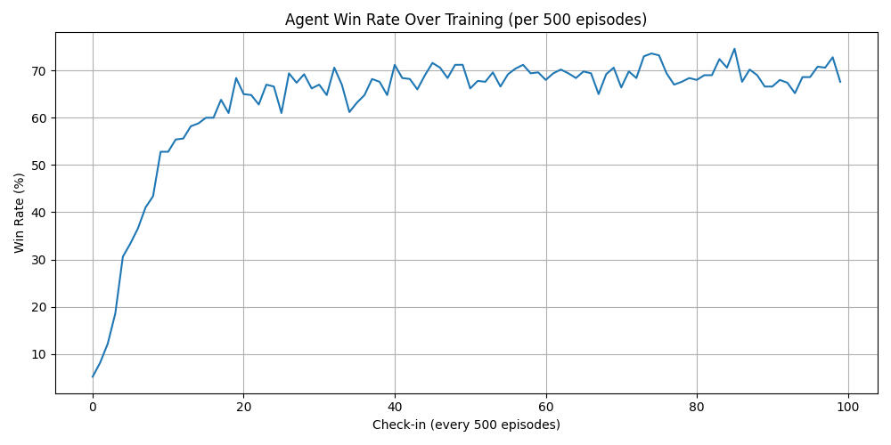
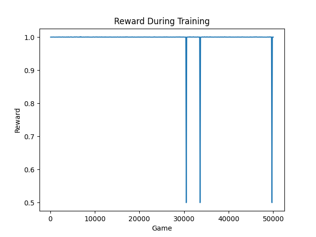
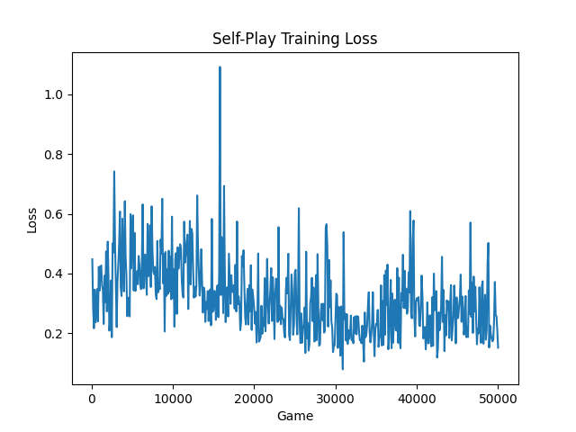
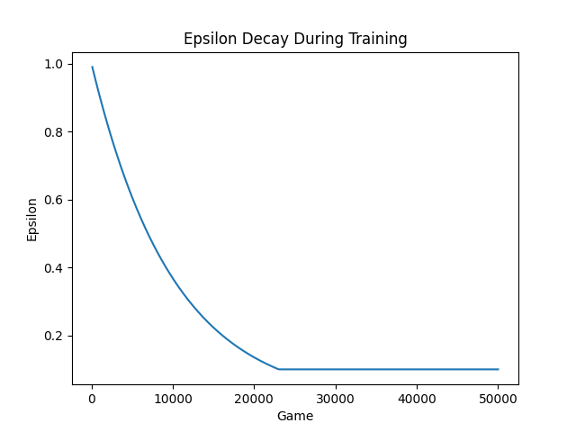
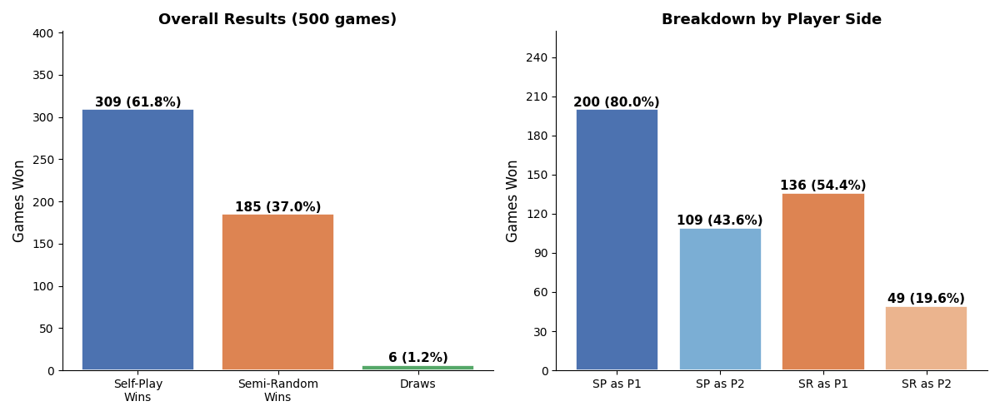

# RL-Connect-4

A browser-playable Connect Four arena with reinforcement-learning agents, saved model checkpoints, and training/evaluation visuals. The app is intentionally lightweight: a Python server owns the game state, a static browser UI renders the board, and the agents choose moves through the same endpoint a human player uses.

<p align="center">
  
  <br />
  <sub><strong>Live browser game.</strong> The app shows the selected mode, game status, and Connect Four board while all moves still go through the Python game server.</sub>
</p>

## What This Project Shows

- A playable Connect Four web app with local human play and agent opponents.
- A checkpoint-backed semi-random RL agent loaded from disk for live games.
- A self-play agent with its own training loop, replay buffer, and saved policy model.
- Evaluation tooling that compares agents head-to-head and saves charts for quick inspection.

## Playable Modes

| Mode | What you are playing |
|---|---|
| `human_vs_human` | Local two-player Connect Four in the browser. |
| `human_vs_self_play` | The self-play policy checkpoint from `agent/self-play/connect4_policy_model.pth`, with tactical win/block checks before neural-network inference. |
| `human_vs_semi_random_rl` | The trained DQN checkpoint from `agent/r-learning/best_dqn.pth`, with immediate win/block checks and a small random-move rate. |

Both agent modes load their checkpoints strictly. If a checkpoint is missing or malformed, the app does not silently replace it with an untrained replacement opponent.

## Agent Details

### Semi-Random RL Agent

The semi-random agent is a Deep Q-Network trained against an opponent that mostly plays legal random moves but will take an immediate win or block the agent's immediate win. That gives the agent a simple curriculum: it learns against noise, but the opponent still punishes obvious tactical mistakes.

The network maps the flattened 6x7 board into seven Q-values:

```text
42 inputs -> 128 hidden units -> 128 hidden units -> 7 column scores
```

Training uses epsilon-greedy exploration, replay memory, terminal rewards, and dense mid-game shaping for center control and three-in-a-row threats. A frozen target model is synced every 500 episodes so TD targets are less volatile, and each episode can run a capped number of replay updates to keep training time predictable.

<p align="center">
  
  <br />
  <sub><strong>Semi-random RL training.</strong> The win-rate curve tracks how the DQN checkpoint improved while training against the semi-random opponent.</sub>
</p>

In the live app, `SemiRandomRLAgent` runs a small tactical layer before the DQN:

```text
1. take an immediate win
2. block an immediate opponent win
3. play a random legal move 15% of the time
4. otherwise use the DQN checkpoint
```

That logic is not a checkpoint fallback. It is the deployed action policy around the trained model.

### Self-Play Agent

The self-play agent uses a separate policy model that views the board from the current player's perspective:

```text
0 = empty cell
1 = current player
2 = opponent
```

Its model is larger than the semi-random DQN:

```text
42 inputs -> 256 hidden units -> 128 hidden units -> 7 column scores
```

The training loop mixes live self-play, a frozen older self-play model, and the semi-random DQN opponent. It evaluates checkpoint candidates against the semi-random DQN and saves a new policy only when the evaluation score improves. During deployed gameplay, the self-play agent adds a small tactical safety layer: take an immediate win, block an immediate loss, then ask the neural policy.

<p align="center">
  
  <br />
  <sub><strong>Self-play reward trend.</strong> Reward logging gives a quick read on whether the policy is finding better move sequences over time.</sub>
</p>

<table>
  <tr>
    <td width="50%" align="center">
      
      <br />
      <sub><strong>Training loss.</strong> Shows the Q-learning update stability while replay batches train the policy model.</sub>
    </td>
    <td width="50%" align="center">
      
      <br />
      <sub><strong>Exploration decay.</strong> Shows the shift from random exploration toward model-selected moves.</sub>
    </td>
  </tr>
</table>

## Agent Evaluation

The project includes a head-to-head evaluator for comparing the deployed self-play checkpoint against the semi-random DQN agent. This is separate from training: it runs completed games, alternates starting seats, and writes a comparison chart under `graphs/`.

<p align="center">
  
  <br />
  <sub><strong>Self-play vs semi-random RL.</strong> The comparison chart summarizes how the two checkpoint-backed agents perform against each other.</sub>
</p>

### Known Tradeoffs

- The semi-random agent can overfit to its training opponent and may plateau against stronger lookahead play.
- Standard DQN targets can overestimate action values, especially in noisy board states.
- The deployed self-play safety layer improves play, but it is inference-time logic rather than pure learned policy behavior.
- Stronger Player 2 performance likely needs better opponent diversity and more pressure around immediate threats.

## How It Works

- `connect4/game.py` implements the board, legal moves, win detection, draws, and scoring helpers.
- `connect4/server.py` exposes the small JSON API used by the browser UI.
- `connect4/agents.py` builds the live opponents and loads saved checkpoints for gameplay.
- `static/` contains the browser experience: mode selection, board rendering, move submission, and game status.
- `scripts/evaluate_agents.py` runs agent-vs-agent matches and writes comparison charts under `graphs/`.

The browser never calls an agent directly. It sends moves to the server, the server updates the `ConnectFourGame`, and then the active `GameSession` asks its configured agent for Player 2's move when needed.

## Local API

| Endpoint | Purpose |
|---|---|
| `GET /api/modes` | List playable modes shown in the UI. |
| `POST /api/games` | Start a new game session for the selected mode. |
| `GET /api/games/<session_id>` | Fetch the current board, status, winner, and active mode label. |
| `POST /api/games/<session_id>/move` | Submit a column move. In agent modes, this can also trigger the agent reply move. |

## Run The App

```bash
./venv/bin/python run.py
```

Then open:

```text
http://127.0.0.1:8000
```

## Train The Semi-Random RL Agent

```bash
./venv/bin/python agent/r-learning/train.py
```

The trainer saves:

- `agent/r-learning/best_dqn.pth`
- `agent/r-learning/win_rate.png`

## Train The Self-Play Agent

```bash
./venv/bin/python agent/self-play/learningLoop.py
```

Useful overrides:

```bash
SELF_PLAY_NUM_GAMES=1000 SELF_PLAY_EVAL_START_GAME=3000 ./venv/bin/python agent/self-play/learningLoop.py
```

The self-play trainer saves the checkpoint and plots in `agent/self-play/`.

## Deeper Docs

- [Semi-random RL agent](agent/r-learning/README.md)
- [Self-play agent](agent/self-play/README.md)
- [Agent comparison script](scripts/evaluate_agents.py)
